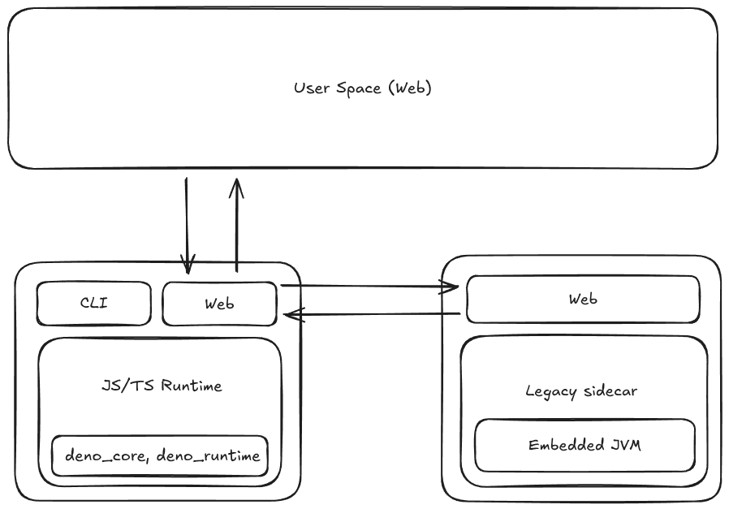

# not-another-js-runtime

## Background

Creating a javascript runtime where user can run their javascript/typescript code, to be run on the server.

### Proposed Diagram

## Quick Intro to Rust

- [Learn Rust in Y Minutes](https://learnxinyminutes.com/rust/)
- [A half-hour to learn Rust](https://fasterthanli.me/articles/a-half-hour-to-learn-rust)

## References

- [Roll your own Javascript Runtime](https://deno.com/blog/roll-your-own-javascript-runtime)
- [Roll your own Javascript Runtime, pt 2](https://deno.com/blog/roll-your-own-javascript-runtime-pt2)
- [Roll your own Javascript Runtime, pt 3](https://deno.com/blog/roll-your-own-javascript-runtime-pt3)

## Further Reading

these are the thing I will try to replicate in smaller scale.

- [How Worker works - Cloudflare Workers docs](https://developers.cloudflare.com/workers/reference/how-workers-works/)
- [Unpacking Cloudflare Workers CPU Performance Benchmarks](https://blog.cloudflare.com/unpacking-cloudflare-workers-cpu-performance-benchmarks/)
- [How to reuse full-featured Deno in my Rust Project? - Stack Overflow](https://stackoverflow.com/questions/79486773/how-to-reuse-full-featured-deno-in-my-rust-project)

## Project Examples

- [Edge Runtime by Supabase](https://github.com/supabase/edge-runtime)
- [Backend as a Service](https://gist.github.com/PARC6502/ee4db400a05e6eb6d0981bb8cd4e4c1c)
